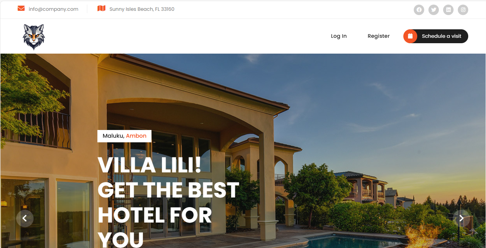
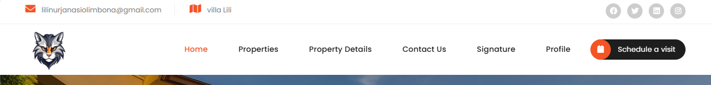
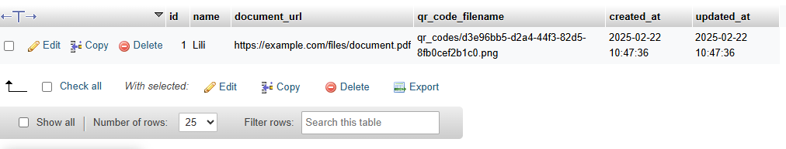

# PROJECT UAS
## Implementasi Fitur Autentikasi Menggunakan Laravel Breeze
1. Membuat Project Baru:  
   ```
   composer create-project laravel/laravel lili_uas
   ```
   
2. Masuk ke File Project:
   ```
   cd lili_uas
   ```
   
3. Install Laravel Breeze:
   ```
   composer require laravel/breeze --dev
   ```
   Kemudian pilih ```blade```--> Untuk proyek berbasis Blade (sederhana dan ringan) dan juga agar fokus pada autentikasi dasar.
   
4. Migrasi Database:
   Mengubah pengaturan database di file ```.env```:
   ```
   DB_CONNECTION=mysql
   DB_HOST=127.0.0.1
   DB_PORT=3306
   DB_DATABASE=lili_uas
   DB_USERNAME=root
   DB_PASSWORD=
   ```
   Perubahan:
            ```DB_CONNECTION=sqlite``` --> ```DB_CONNECTION=mysql``` Karena pada dasarnya MySQL memiliki kelebih Dukungan Penuh dan Cocok Untuk Aplikasi Besar.
            ```DB_DATABASE=Laravel``` --> ```DB_DATABASE=lili_uas``` Menyesuaikan dengan nama database yang dibuat sebelumnya.
   
6. Membuat Tabel:
   Jalankan migrasi untuk membuat tabel pengguna dan tabel terkait autentikasi:
   ```
   php artisan migrate
   ```
   
7. Menjalankan Aplikasi:
   ```
   php artisan serve
   ```
   Kemudian ```Ctrl + Klik[http://127.0.0.1:8000]```
   
   Breeze akan menyiapkan rute seperti:
   - ```/register``` --> Registrasi
   - ```/login``` --> Login
   - ```/dashboard``` --> Dashboard (memerlukan autentikasi)
    
8. Contoh Code:
   Semua rute yang berkaitan dengan autentikasi berada di          ```routes/auth.php```. Ini di impor secara otomatis ke dalam Aplikasi.
   a) Controller untuk Dashboard:
       Membuat file app/Http/Controllers/DashboardController.php dengan perintah:
       ```
       php artisan make:controller DashboardController
       ```
      Code :
       ```
           <?php

            namespace App\Http\Controllers;
            
            use Illuminate\Http\Request;
            
            class DashboardController extends Controller
            {
                public function index()
            {
                return view('dashboard');
            }
            
            }
       ```
   b) Perbarui rute di ```routes/web.php```:
       ```
       use App\Http\Controllers\DashboardController;
       
       Route::get('/dashboard', [DashboardController::class, 'index'])->middleware('auth')->name('dashboard');
       ```
   d) Breeze secara otomatis sudah menyiap fungsi Logout.

   
10. Uji Coba Login dan Register:
   ## Register:
   
   ## Login:
   
   Saat User berhasil melakukan Register atau Login maka akan diarahkan ke halaman Dashboard:
   

   Data user akan tersimpan di database yang sudah dibuat sebelumnya, tepatnya pada Tabel ```user```.
   


## Membuat middleware di Laravel untuk mencegah serangan XSS
1. Membuat Projek:
   ```
   composer create-project laravel/laravel xss-protection
   ```
   
2. Masuk ke File Projek:
   ```
   cd xss-protection
   ```
   
3. Membuat Middleware untuk Mencegah XSS:
   ```
   php artisan make:middleware XSSProtection
   ```
   
4. Edit file ```app/Http/Middleware/XSSProtection.php```:
   ```
   <?php

    use Illuminate\Foundation\Application;
    use Illuminate\Foundation\Configuration\Exceptions;
    use Illuminate\Foundation\Configuration\Middleware;
    use App\Http\Middleware\XSSProtection;
    
    return Application::configure(basePath: dirname(__DIR__))
        ->withRouting(
            web: __DIR__.'/../routes/web.php',
            commands: __DIR__.'/../routes/console.php',
            health: '/up',
        )
        ->withMiddleware(function (Middleware $middleware) {
            $middleware->append(XSSProtection::class); // Tambahkan middleware di sini
        })
        ->withExceptions(function (Exceptions $exceptions) {
            //
        })->create();
   ```
   
5. Mendaftar Middleware di Kernel:
   Buka file ```app/Http/Kernel.php``` dan tambahkan middleware baru di grup ```web```:
   ```
    protected $middlewareGroups = [
        'web' => [
            // Middleware bawaan Laravel
            \App\Http\Middleware\XSSProtection::class, // Tambahkan ini
        ],
        'api' => [
            // Middleware API
        ],
    ];
   ```
   
6. Menguji Middleware:
   Buat controller untuk menguji middleware:
   ```
   php artisan make:controller XSSController
   ```

   Edit file ```app/Http/Controllers/XSSController.php```:
   ```
   <?php

    namespace App\Http\Controllers;
    
    use Illuminate\Http\Request;
    
    class XSSController extends Controller
    {
        public function store(Request $request)
        {
            return response()->json([
                'clean_input' => $request->all(),
            ]);
        }
    }
   ```

   Tambahkan rute di ```routes/web.php```:
   ```
   use App\Http\Controllers\XSSController;
    
   Route::post('/xss-test', [XSSController::class, 'store']);
   ```

   Kirim request menggunakan cuURL:
   ```
   Starting Laravel development server: http://127.0.0.1:8000
   ```

   Jika middleware XSSProtection berjalan dengan benar, akan melihat output seperti ini:
   ```
   {
      "clean_input": {
        "input": "alert('xss')"
      }
   }
   ```

## Menambahkan logo sebagai watermark pada halaman login, navbar, dan footer menggunakan Laravel Blade.
1. Siapkan file gambar yang akan dijadikan sebagai logo watermark. Kemudian file gambar diletakkan di folder ```public/images/logo.png```.
2. Kemudian masuk ke projek aplikasi yaitu ```winda_uas``` diatas, dan buka file             ```resources/views/layout/navigation.blade.php```. Dan ubah code ini:
    ```
    <x-application-logo src="{{ asset('images/custom-logo.png') }}" />
    ```
    Menjadi:
    ```
    
    ```
    
   ### Hasil :
   
   
3. Lakukan hal yang sama untuk merubah logo pada footer dan otomatis akan merubah logo watermark pada halaman Login & Register:
   
   ### Hasil:
   
   


## Membuat Fitur Tanda Tangan Digital Dengan URL Menjadi Sebuah QR Code
1. Install Library ```simple-qrcode```:
   ```
   composer require simplesoftwareio/simple-qrcode
   ```
2. Menambahkan Controller pada ```app/Http/Controllers/```:
   ```
   php artisan make:controller QRCodeController
   ```
3. Membuat Model dan Migrasi Database:
   ```
   php artisan make:model Signature -m
   ```
4. Edit Migrasi ```database/migrations/2025_02_19_180020_create_qr_codes_table.php```:
   ```
        public function up(): void {
            Schema::create('signatures', function (Blueprint $table) {
                $table->id();
                $table->string('name');
                $table->string('document_url');
                $table->string('qr_code_path');
                $table->timestamps();
            });
        }
   ```
5. Jalankan Migrasi:
   ```
   php artisan migrate
   ```
6. Membuat route di ```routes/web.php```:
   ```
    use App\Http\Controllers\ProfileController;
    use Illuminate\Support\Facades\Route;
    use App\Http\Controllers\SignatureController;
    use App\Http\Controllers\DashboardController;
    use App\Http\Controllers\PropertiesController;
    use App\Http\Controllers\PropertyController;
    
    Route::get('/signature/create', [SignatureController::class, 'create'])->name('signature.create');
    Route::post('/signature/store', [SignatureController::class, 'store'])->name('signature.store');
    Route::get('/signature/{id}', [SignatureController::class, 'show'])->name('signature.show');

   ```
7. Membuat Tampilan Form Input:
   ```
   <body>
        <div class="container">
            <h1>Buat Tanda Tangan Digital</h1>
            <form action="{{ route('signature.store') }}" method="POST">
                @csrf
                <label for="name">Nama:</label>
                <input type="text" id="name" name="name" placeholder="Masukkan nama Anda" required>
    
                <label for="document_url">URL Dokumen:</label>
                <input type="url" id="document_url" name="document_url" placeholder="Masukkan URL dokumen" required>
    
                <button type="submit">Buat QR Code</button>
            </form>
        </div>
    </body>
   ```

   Dan buat file ```resources/view/signature/show.blade.php``` untuk tampilan menampilkan qr code setelah berhasil di buat:

   ```
   <body>
    <div class="container">
            <h1>Detail Tanda Tangan Digital</h1>
            <p><strong>Nama:</strong> {{ $signature->name }}</p>
            <p><strong>URL Dokumen:</strong> <a href="{{ $signature->document_url }}" target="_blank">{{ $signature->document_url }}</a></p>
            <p><strong>QR Code:</strong></p>
            qr_code_path) }}" alt="QR Code">
        </div>
    </body>
   ```
9. Membuat Logika di Controller:
   - ```Edit app/Http/Controllers/SignatureController.php```:
     ```
        use Illuminate\Http\Request;
        use App\Models\Signature;
        use SimpleSoftwareIO\QrCode\Facades\QrCode;
        use Illuminate\Support\Facades\Storage;
        
        class SignatureController extends Controller
        {
            public function create()
            {
                return view('signature.create');
            }
        
            public function store(Request $request)
            {
                $request->validate([
                    'name' => 'required|string|max:255',
                    'document_url' => 'required|url'
                ]);
        
                $name = $request->name;
                $documentUrl = $request->document_url;
        
                // Generate QR Code
                $qrCodeFileName = uniqid('qrcode_') . '.png';
                $qrCodePath = 'qrcodes/' . $qrCodeFileName;
        
                $qrCode = QrCode::format('png')->size(200)->generate($documentUrl);
                Storage::disk('public')->put($qrCodePath, $qrCode);
        
                // Simpan ke database
                $signature = Signature::create([
                    'name' => $name,
                    'document_url' => $documentUrl,
                    'qr_code_path' => $qrCodePath
                ]);
        
                return redirect()->route('signature.show', $signature->id);
            }
        
            public function show($id)
            {
                $signature = Signature::findOrFail($id);
                return view('signature.show', compact('signature'));
            }
        }

     ```
     
   - Tambahkan pintasan di menu Dashboard untuk menuju ke halaman Create QR Code. Edit ```resources/views/layout/Navigation.blade.php```:
     ```
     <!-- Genetate QR Code -->
                    <x-nav-link :href="route('create-qrcode')" :active="request()->routeIs('create-qrcode')">
                        {{ __('Create QR Code') }}
                    </x-nav-link>
     ```
10. Menguji Fitur:
   Input URL dokumen:
   

   Hasil:
   
11. URL akan disimpan ke database pada tabel winda_uas:
    

    - Dan untuk QR Code yang dihasilkan akan tersimpan di ```storage/app/public/qr_codes/``` sebagai format .png:
    


    Fitur Generator QR Code dari sebuah URL berhasil di buat.


## Mengiplementasikan Captcha pada form login/registrasi Laravel untuk menghindari serangan bot.
1. Kunjungi Google reCAPTCHA Admin di browser
2. Pilih reCAPTCHA v2, dan pilih "I'm not robot"
3. Masukkan domain aplikasi, karena disini saya menggunakan local host maka saya memasukkan domain:
   ```localhost```
   kemudian tambahkan domain lagi, yaitu alamat lokal aplikasi Laravel saat menjalannya di browser:
   ```127.0.0.1```

4. Instalasi Paket untuk reCAPTCHA
   Saya menggunakan paket ```anhskohbo/no-captcha``` untuk mempermudah integrasi reCAPTCHA di Laravel:
   ```
   composer require anhskohbo/no-captcha
   ```
5. Konfigurasi Google reCAPTCHA
   Tambahkan ```NOCAPTCHA_SECRET``` dan ```NOCAPTCHA_SITEKEY``` di file ```.env```:
   ```
   NOCAPTCHA_SECRET=your-secret-key
   NOCAPTCHA_SITEKEY=your-site-key
   ```
6. Ubah key pada file ```.env```:
   
   ```
   NOCAPTCHA_SITEKEY=6Leu9t4qAAAAAApKhoG8mNujjp-tnYGioc4s2EWu
   NOCAPTCHA_SECRET=6Leu9t4qAAAAAFNqD5W9xWqUyq_ovjftrCYM0McU
   ```

   Mendaftarkan konfigurasi di ```config/service.php```:
   ```
   // config/services.php
   return [
        // ...
        'recaptcha' => [
            'sitekey' => env('NOCAPTCHA_SITEKEY'),
            'secret' => env('NOCAPTCHA_SECRET'),
        ],
   ];
   ```
7. Menambahkan reCAPTCHA di Halaman Login
   ## Register
   ```
   {!! NoCaptcha::display() !!}

        <div class="flex items-center justify-end mt-4">
            <a class="underline text-sm text-gray-600 hover:text-gray-900 rounded-md focus:outline-none focus:ring-2 focus:ring-offset-2 focus:ring-indigo-500" href="{{ route('login') }}">
                {{ __('Already registered?') }}
            </a>

            <x-primary-button class="ms-4">
                {{ __('Register') }}
            </x-primary-button>
        </div>
    </form>

    {{-- Load Script reCAPTCHA --}}
    {!! NoCaptcha::renderJs() !!}
   ```
8. Validasi reCAPTCHA di Controller ```app/Http/Controllers/Auth/RegisteredUserController.php```
   ```
   $request->validate([
                'name' => ['required', 'string', 'max:255'],
                'email' => ['required', 'string', 'lowercase', 'email', 'max:255', 'unique:'.User::class],
                'password' => ['required', 'confirmed', Rules\Password::defaults()],
                'g-recaptcha-response' => 'required|captcha',
            ]);
   ```

9. Uji Coba

   # REGISTER
   
    
    
    
